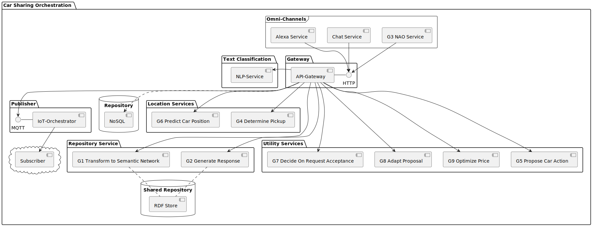
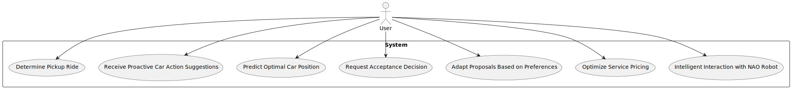
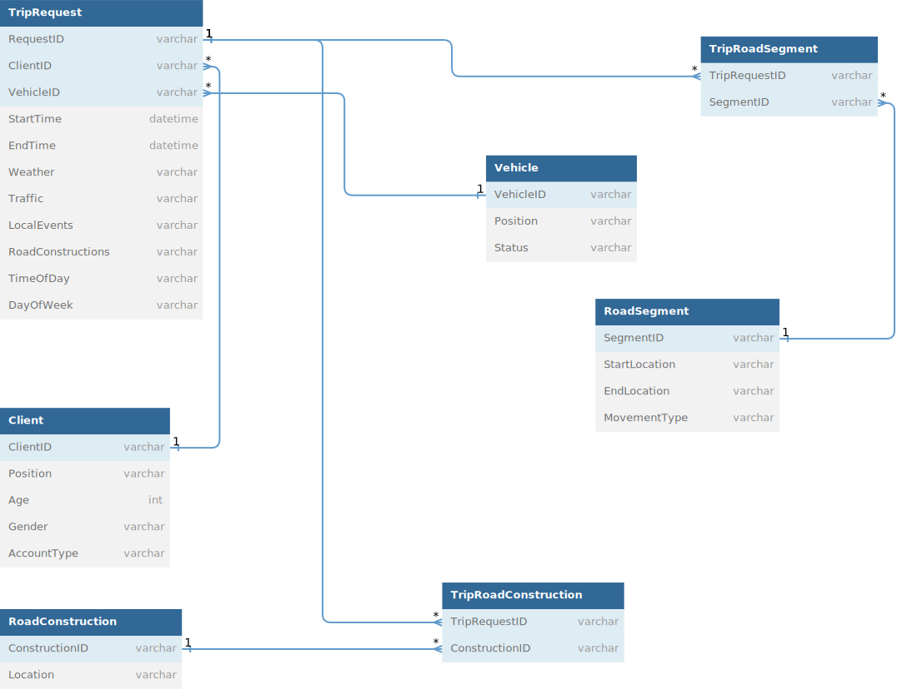
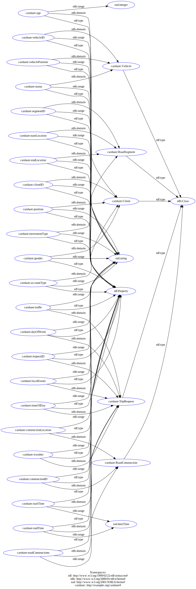
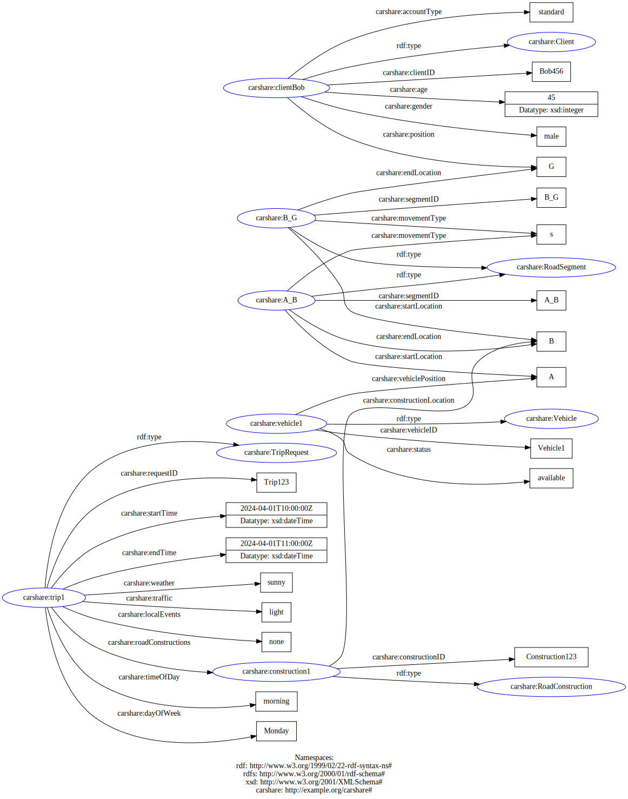
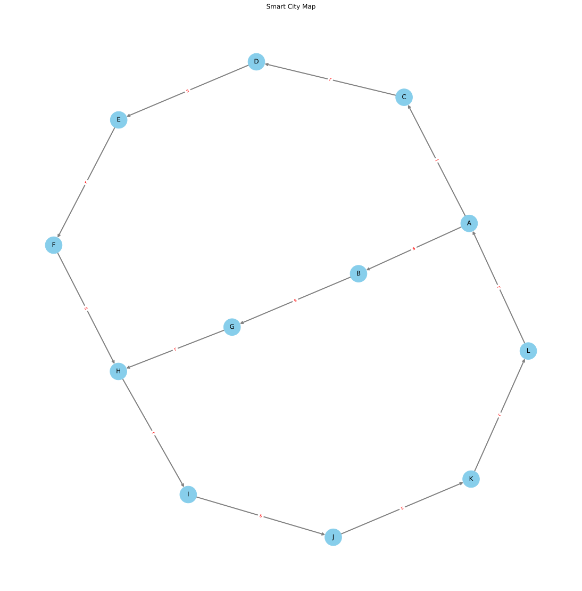
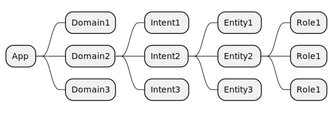
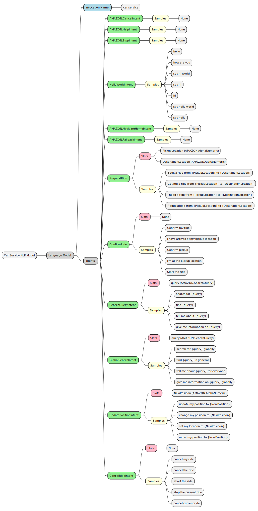

# Car Service Orchestration

This repository contains a collection of microservices designed to orchestrate the car service process, from unstructured data ingestion to intelligent decision-making for car positioning, pricing, and customer service personalization.

# Table of Contents
1. [Introduction](#introduction)
   - [Problem Statement](#problem-statement)
   - [Value Proposition](#value-proposition)
   - [Technologies and Approach](#technologies-and-approach)
2. [Bird Eye View](#bird-eye-view)
3. [Use Case Diagram](#use-case-diagram)
4. [Domain Model](#domain-model)
5. [NLP Model Hierarchy](#nlp-model-hierarchy)
6. [Example Intents](#example-intents)
7. [Microservices](#microservices)
   1. [Unstructured/Open Data to Semantic Network (RDF)](#unstructuredopen-data-to-semantic-network-rdf)
   2. [Semantic Network to Text/Chat-Message](#semantic-network-to-textchat-message)
   3. [Semantic Network for NAO (Robotics)](#semantic-network-for-nao-robotics)
   4. [Car Decision on Meeting Points](#car-decision-on-meeting-points)
   5. [Car Proposes State and Actions Based on State/Sensors](#car-proposes-state-and-actions-based-on-statesensors)
   6. [Car Position Prediction](#car-position-prediction)
   7. [Car Acceptance Decision Based on Past Behavior](#car-acceptance-decision-based-on-past-behavior)
   8. [Adaptation to Customer Preferences](#adaptation-to-customer-preferences)
   9. [Intelligent Pricing (Optimize Price)](#intelligent-pricing-optimize-price)
   10. [Modern AI Systems](#modern-ai-systems)
8. [Business Workflow](#business-workflow)
9. [Getting Started](#getting-started)
   - [Prerequisites](#prerequisites)
   - [Installation](#installation)
10. [Configuration](#configuration)
11. [Usage Examples](#usage-examples)
12. [Contributing](#contributing)
13. [License](#license)
14. [Contact](#contact)


# Introduction

This repository is dedicated to simplifying and enhancing the car service experience through a network of intelligent microservices. It addresses the challenges of managing unstructured data, making smart decisions for vehicle positioning, optimizing pricing strategies, and personalizing customer service. By leveraging advanced technologies such as NLP, semantic networks, and machine learning, this project aims to set a new standard in smart mobility.

## Problem Statement

The car service industry today faces numerous challenges, including inefficient use of resources, lack of personalization in customer service, and difficulties in managing and interpreting unstructured data. Traditional systems struggle to adapt to the dynamic demands of customers and the logistical complexities of vehicle positioning and service pricing. This results in suboptimal customer experiences and operational inefficiencies that can lead to increased costs and decreased service quality.

## Value Proposition

The Car Service Orchestration project addresses these challenges by providing a comprehensive solution designed to optimize vehicle positioning, personalize customer interactions, and dynamically adjust pricing. By leveraging a network of intelligent microservices, the project transforms unstructured data into actionable insights, enabling smarter decision-making and enhancing the overall efficiency of car service operations. This approach not only improves customer satisfaction through tailored services and recommendations but also increases operational efficiency by optimizing resource allocation and pricing strategies. The result is a more agile, customer-focused service offering that stands out in a competitive market.

## Technologies and Approach

The Car Service Orchestration project utilizes a cutting-edge technology stack and innovative approaches to achieve its goals.

- Semantic Networks and Natural Language Processing (NLP): Employ NLP and semantic networks to interpret and structure unstructured data such as natural language inputs, transforming it into a semantic network (RDF) that facilitates intelligent decision-making and personalized customer interactions

- Machine Learning and AI: Through the use of machine learning models, including reinforcement learning and decision trees, the project predicts optimal car positions, adapts to customer preferences, and optimizes pricing strategies in real-time

- Robotics and IoT: Integrating robotics (e.g., NAO robot, Amazon Alexa) and IoT devices enables direct interaction with customers through IoT devices

- Microservices Architecture: The project is built on a full microservices architecture, ensuring scalability

# Bird Eye View



# Use Case Diagram



# Use Case Descriptions

1. **Request Determine Pickup Ride**: 

3. **Receive Proactive Car Action Suggestions**: User receives suggestions from the car based on its current state and sensors.

4. **Predict Optimal Car Position**: User requests prediction of the optimal car position for future requests.

5. **Request Acceptance Decision**: User submits a service request and the system decides whether to accept it based on various factors.

6. **Adapt Proposals Based on Preferences**: User receives tailored proposals based on their preferences and past behavior.

7. **Optimize Service Pricing**: User receives optimized pricing for requested services based on various factors.

8. **Intelligent Interaction with NAO Robot**: User interacts with a NAO robot that provides intelligent responses based on the semantic network.

## Use Case: Request Pickup Location

| **Use Case ID**  | UC01                                          |
|------------------|-----------------------------------------------|
| **Use Case Name**| Request Pickup Location                       |
| **Description**  | User requests an optimal pickup location based on current conditions. |
| **Actors**       | User, Pickup Service                          |
| **Preconditions**| User is authenticated, system has access to weather, traffic, and local event data. |
| **Postconditions**| User receives the optimal pickup location.    |
| **Main Flow**    | 1. User requests a pickup.<br>2. System collects data on weather, traffic, and local events.<br>3. System processes data to determine the optimal pickup location.<br>4. System sends the optimal pickup location to the user. |
| **Alternate Flow**| 2a. Data source unavailable.<br>3a. System retries data collection.<br>4a. Log error if retries fail and provide nearest available location. |


## Use Case: Confirm Arrival and Execute Ride

| **Use Case ID**  | UC02                                          |
|------------------|-----------------------------------------------|
| **Use Case Name**| Confirm Arrival and Execute Ride              |
| **Description**  | User confirms arrival at the provided pickup location, and the system executes the ride by triggering IoT orchestration. |
| **Actors**       | User, Ride Service, IoT Orchestration System   |
| **Preconditions**| User has received the optimal pickup location, system is ready to trigger IoT orchestration for the ride. |
| **Postconditions**| Ride is initiated, and IoT orchestration is triggered. |
| **Main Flow**    | 1. User arrives at the provided pickup location and confirms arrival.<br>2. System verifies the confirmation.<br>3. System triggers IoT orchestration to initiate the ride.<br>4. System confirms to the user that the ride has been initiated. |
| **Alternate Flow**| 2a. User confirmation not received.<br>3a. System prompts user for confirmation again.<br>4a. Log error if confirmation fails and notify the user to retry. |


## Use Case: Receive Car Status Notifications and Admin Monitoring

| **Use Case ID**  | UC03                                          |
|------------------|-----------------------------------------------|
| **Use Case Name**| Receive Car Status Notifications and Admin Monitoring |
| **Description**  | The system receives notifications about the car's status, and administrators can check the status of the cars. |
| **Actors**       | System, Administrator, Car System             |
| **Preconditions**| Car sensors are operational, administrators are authenticated. |
| **Postconditions**| System receives notifications, and administrators can view the status of the cars. |
| **Main Flow**    | 1. Car collects data from its sensors.<br>2. System receives and processes sensor data.<br>3. System generates notifications about the car's status.<br>4. Administrators log into the system.<br>5. Administrators check the status of the cars through the system dashboard. |
| **Alternate Flow**| 2a. Sensor data unavailable.<br>3a. System retries data collection.<br>4a. Log error if retries fail and notify administrators of limited functionality. |


## Use Case: Receive Regular Notifications for Car Positioning

| **Use Case ID**  | UC04                                          |
|------------------|-----------------------------------------------|
| **Use Case Name**| Receive Regular Notifications for Car Positioning |
| **Description**  | The system receives regular push notifications about car positioning, which are placed into a message queue and picked up to notify the car to position itself optimally. |
| **Actors**       | System, Car System                            |
| **Preconditions**| Car system and message queue are operational. |
| **Postconditions**| Car receives notifications to position itself optimally. |
| **Main Flow**    | 1. System receives regular push notifications.<br>2. Notifications are placed into the message queue.<br>3. Car system picks up notifications from the message queue.<br>4. Car system processes the notification and positions the car optimally. |
| **Alternate Flow**| 1a. Push notifications fail.<br>2a. System retries sending notifications.<br>3a. Log error if retries fail and notify administrators of the issue. |


## Use Case: Request Acceptance Decision

| **Use Case ID**  | UC05                                          |
|------------------|-----------------------------------------------|
| **Use Case Name**| Request Acceptance Decision                   |
| **Description**  | User submits a service request and the system decides whether to accept it based on various factors. |
| **Actors**       | User, Car System                              |
| **Preconditions**| User is authenticated, system has access to relevant data and models. |
| **Postconditions**| User receives acceptance or rejection of the request. |
| **Main Flow**    | 1. User submits a service request.<br>2. System processes the request using historical and real-time data.<br>3. System decides on acceptance or rejection.<br>4. System sends the decision to the user. |
| **Alternate Flow**| 2a. Relevant data unavailable.<br>3a. System retries data collection.<br>4a. Log error if retries fail and notify user of inability to process request. |

## Use Case: Adapt Proposals Based on Preferences

| **Use Case ID**  | UC06                                          |
|------------------|-----------------------------------------------|
| **Use Case Name**| Adapt Proposals Based on Preferences          |
| **Description**  | User receives tailored proposals based on their preferences and past behavior. |
| **Actors**       | User, Proposal System                         |
| **Preconditions**| User is authenticated, system has access to user preference data. |
| **Postconditions**| User receives tailored proposals.            |
| **Main Flow**    | 1. User logs in and sets preferences.<br>2. System collects and processes user data.<br>3. System generates tailored proposals.<br>4. System sends proposals to the user. |
| **Alternate Flow**| 2a. User data unavailable.<br>3a. System uses default preferences.<br>4a. Notify user of limited customization. |

## Use Case: Optimize Service Pricing

| **Use Case ID**  | UC07                                          |
|------------------|-----------------------------------------------|
| **Use Case Name**| Optimize Service Pricing                      |
| **Description**  | User receives optimized pricing for requested services based on various factors. |
| **Actors**       | User, Pricing System                          |
| **Preconditions**| User is authenticated, system has access to market and service data. |
| **Postconditions**| User receives optimized pricing for the requested service. |
| **Main Flow**    | 1. User requests service pricing.<br>2. System collects and processes market and service data.<br>3. System applies genetic algorithms to optimize pricing.<br>4. System sends optimized pricing to the user. |
| **Alternate Flow**| 2a. Market data unavailable.<br>3a. System uses historical data.<br>4a. Notify user of potentially less accurate pricing. |

## Use Case: Intelligent Interaction with NAO Robot

| **Use Case ID**  | UC08                                          |
|------------------|-----------------------------------------------|
| **Use Case Name**| Intelligent Interaction with NAO Robot        |
| **Description**  | User interacts with a NAO robot that provides intelligent responses based on the semantic network. |
| **Actors**       | User, NAO Robot                               |
| **Preconditions**| User is authenticated, NAO robot and semantic network are operational. |
| **Postconditions**| User receives intelligent responses from the NAO robot. |
| **Main Flow**    | 1. User initiates interaction with NAO robot.<br>2. NAO robot sends user query to system.<br>3. System processes query using semantic network.<br>4. System generates and sends response to NAO robot.<br>5. NAO robot delivers response to user. |
| **Alternate Flow**| 2a. Semantic network data outdated.<br>3a. System updates semantic network.<br>4a. Retry response generation. |


# RDBMS Schema



# RDF Schema



# RDF Example data



# Smart City Map



# NLP Domain Model



# NLP Model Hierarchy



## Example Intents

Reference: [Intents, Utterances, and Slots](https://developer.amazon.com/en-US/docs/alexa/custom-skills/create-intents-utterances-and-slots.html)

**Navigation and Location Services**:
- Alexa, find the best route to downtown?
- Alexa, where should I wait for my car pickup?
- Alexa, where is the nearest available car?

**Ride and Car Status**:
- Alexa, what is the arrival time of my ride?
- Alexa, what's the status of the car?

**Preferences**:
- Alexa, I want to pick up a luxury car for tonight's event
- Alexa, I prefer a quiet and smooth ride for my trip

**Cost**:
- Alexa, what's the estimated cost for a ride?


## Microservices

### 1. Unstructured/Open Data to Semantic Network (RDF)

**Operation**: transformToSemanticNetwork

**Topic**: Structure available data to be used for further processing

**Description**: 

- Collect open data relevant to smart mobility (traffic
patterns, geographic information, user preferences).
- Convert this data into a semantic network, creating
meaningful relationships and categories.

**Guiding question/s**: How can a consistent resulting structure be achieved?

**Technology**: Open Data to Semantic Network, Natural Language Processing (NLP), Semantic Networks (RDF focused)

- [Apache Jena](https://jena.apache.org/)
- [rdflib](https://rdflib.readthedocs.io/en/stable/)
- [rdf4j](https://rdf4j.org/)
- [Owlready2](https://owlready2.readthedocs.io/en/v0.42/index.html)

Each arc in an RDF Model is called a statement. Each statement asserts a fact about a resource. A statement has three parts:

the subject is the resource from which the arc leaves
the predicate is the property that labels the arc
the object is the resource or literal pointed to by the arc
A statement is sometimes called a triple, because of its three parts.

**Data Sources/ Parameters**: E.g. World wide web / web-pages, Text files, Natural Language, Mobile and communications data

**Input**: TBD

**Output**: E.g. [RDF/XML](https://www.w3.org/TR/rdf-syntax-grammar/), [JSON-LD](https://json-ld.org/), [Turtle](https://www.w3.org/TR/turtle/)

### 2. Semantic Network to Text/Chat-Message

**Operation**: generateResponse

**Topic**: Intelligent interaction of car with customer via text messages

**Description**: 

- Use semantic networks to generate text messages
providing an answer / proposal to a request from the user
(customer).
- Ensure the system can handle queries and provide
informative, context-aware responses.

**Guiding question/s**: What is the relevant input and where does it come from? How can the system cope with changes to the semantic network?

**Technology**: Semantic Network to Text, Semantic data processing algorithms

- [Apache Jena](https://jena.apache.org/)
- [rdflib](https://rdflib.readthedocs.io/en/stable/)
- [rdf4j](https://rdf4j.org/)
- [Owlready2](https://owlready2.readthedocs.io/en/v0.42/index.html)

**Data Sources/ Parameters**: The input of the request can come from various sources (smartphone, direct user input, etc.), but can be assumed to be a semantic network

**Input**: E.g. [RDF/XML](https://www.w3.org/TR/rdf-syntax-grammar/), [JSON-LD](https://json-ld.org/), [Turtle](https://www.w3.org/TR/turtle/)

**Output**: E.g. JSON, XML

### 3. Semantic Network for NAO (Robotics)

**Operation**: generateResponse

**Topic**: Intelligent interaction of car with customer through a robot

**Description**: 

- Program a (NAO) robot to interact with customers,
leveraging the semantic network for response generation
- Focus on natural language processing and human-robot 
interaction principles.

**Guiding question/s**: What is the relevant input and where does it come from? How can the system cope with changes to the semantic network?

**Technology**: Semantic Network for NAO (Robotics), Semantic data processing algorithms

- [ROS (Robot Operating System)](https://www.ros.org/)

**Data Sources/ Parameters**: The input of the request can come from various sources (smartphone, direct user input etc.), but can be assumed to be a semantic network.

**Input**: E.g. [RDF/XML](https://www.w3.org/TR/rdf-syntax-grammar/), [JSON-LD](https://json-ld.org/), [Turtle](https://www.w3.org/TR/turtle/)

**Output**: TBD


### 4. Car Decision on Meeting Points

**Operation**: determinePickUp

**Topic**: Car determines optimal place to pick up customer from

**Description**: 

- Find an optimal place where the car should pick up the
customer based on various parameters.
- Create rules and logic statements that determine the best
pickup locations based on various factors.

**Guiding question/s**:

**Technology**: First-Order Logic, Rule-Based Systems

- [SWI-Prolog](https://www.swi-prolog.org/)
- [CLIPS](https://www.clipsrules.net/)
- [Drools](https://www.drools.org/)

**Data Sources/ Parameters**: Weather, traffic, road constructions, local events

**Input**: E.g. JSON, XML

**Output**: E.g. JSON, XML

### 5. Car Proposes State and Actions Based on State/Sensors

**Operation**: proposeCarAction

**Topic**: Car proposes actions based on current state

**Description**: 
- Develop a fuzzy logic system that can propose actions for
the car based on current states. Actions that require the
user should include incentives. Consider actions to also
arise during driving with a customer.
- Ensure the system can handle ambiguity and provide
practical suggestions.

**Guiding question/s**: Which parameters benefit from being able to handle fuzziness? What structures / patterns of rules are relevant for realizing the system?

**Technology**: Fuzzy logic

- [jFuzzyLogic](https://jfuzzylogic.sourceforge.net/)
- [fuzzylogic](https://pypi.org/project/fuzzylogic/)

**Data Sources/ Parameters**: Use data about the state of the car and the environment, e.g., fuel level, traffic.

**Input**: E.g. JSON, XML

**Output**: E.g. JSON, XML

### 6. Car Position Prediction

**Operation**: predictCarPosition

**Topic**: Optimal car position

**Description**: 

- Implement a reinforcement learning model to predict optimal car positions for future requests
- Train the model with historical data inputs.

**Guiding question/s**: Uses data from the past to update behavior for the present / near future

**Technology**: Reinforcement Learning with Neural Networks

- [Tensorflow](https://www.tensorflow.org/)
- [PyTorch](https://pytorch.org/)
- [Deeplearning4j](https://deeplearning4j.konduit.ai/)

**Data Sources/ Parameters**: What kind of historical data can be utilized for training? (example source for datasets http://archive.ics.uci.edu/datasets ) How can different strategies for the cars be defined and/or trained? What different kinds of "optimum" are there?

**Input**: E.g. JSON, XML

**Output**: E.g. JSON, XML

### 7. Car Acceptance Decision Based on Past Behavior

**Operation**: decideOnRequestAcceptance

**Topic**: Car decides whether a request should be accepted

**Description**: 

- Use Hidden Markov Models to decide whether to accept or decline a customer request.
- Consider factors like current car positions, predicted
demand, actual demand (multiple requests) and customer
history

**Guiding question/s**: What modifiers to an offer ("counter-offer") could be used to accept certain offers under specific conditions? Are there certain states towards which the model evolves towards?

**Technology**: Hidden Markov models

- Own implementation
- [HMMlearn](https://hmmlearn.readthedocs.io/)
- [Tensorflow HMM](https://www.tensorflow.org/probability/api_docs/python/tfp/distributions/HiddenMarkovModel)

**Data Sources/ Parameters**: Example parameters for customer history: Timeliness, cleanliness, cancellations, ..

**Input**: E.g. JSON, XML

**Output**: E.g. JSON, XML

### 8. Adaptation to Customer Preferences

**Operation**: adaptProposal

**Topic**: Adapt proposal based on customer preference

**Description**: 
- Create decision trees to tailor proposals based on individual customer preferences
- Analyze historical data to understand and predict customer choices
- The solution should be able to learn, and decision trees be
adapted during use

**Guiding question/s**: How can the Decision Tree be updated at run-time based on past results? What samples are relevant?

**Technology**: Decision trees through Machine Learning

- [Sckikit-learn](https://scikit-learn.org/)
- [Apache Spark](https://spark.apache.org/mllib/)

**Data Sources/ Parameters**: Example parameters: Car size, driving proficiency, preferred route, driving sickness ..

**Input**: E.g. JSON, XML

**Output**: E.g. JSON, XML

### 9. Intelligent Pricing (Optimize Price)

**Operation**: optimizePrice

**Topic**: Optimize price to handle request

**Description**: 
- Employ genetic algorithms to find the optimal pricing strategy for handling requests.
- The solution evolves the price formula based on parameters from the environment / market. Consider evolving factors.
- Consider various optimizations. Optimizing: Price for customer? Price asked by company? Cost for customer?

**Guiding question/s**: What parameters are relevant for prize optimization? How do various fitness functions behave, and which seems the most promising?

**Technology**: Genetic algorithms, Genetic Programming

- [PyGAD](https://pygad.readthedocs.io)
- [Jenetic](https://jenetics.io/)
- [DEAP](https://deap.readthedocs.io/)

**Data Sources/ Parameters**: Example evolving parameters: Demand, customer loyalty, time, day, weather, remoteness

**Input**: E.g. JSON, XML

**Output**: E.g. JSON, XML

## Business Workflow

## Getting Started

### Prerequisites

### Installation

**Local Development**:

Ensure that your machine has proper DNS settings in /etc/resolv.conf

```sh
cat /etc/resolv.conf
nameserver 8.8.8.8
nameserver 8.8.4.4
```

Then, we can install the required dependencies:

```sh
docker compose --profile local --env-file dev.env up --build -d
```

**Production**:

```sh
docker compose --env-file prod.env up --build -d
```