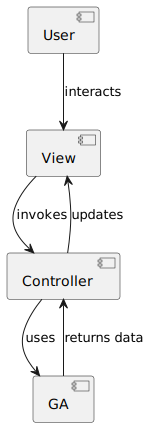

# G9_optimizePrice

This server calculates the optimal prices for a request based on [Genetic Algorithms](https://en.wikipedia.org/wiki/Genetic_algorithm). The user can decide between three different ways to get the optimal price. First, the calculation of the optimal price for the company. Second, the calculation of the optimal price based on the costs for a customer. And last, the calculation of the optimal price for the customer.

## Video

https://youtu.be/m3URt73brpU

## Group members

Jan Köck - 11801301

Milena Meier - 11715898

Sofiia Badera - 11715248

Alexander Tampier - 51833436

## How to build and deploy

```
$ docker-compose build
$ docker-compose up
```

## How to use

Visit server under the following address
```
http://127.0.0.1:5000
```

Visit the swagger documentation under the following address for testing the REST endpoints
```
http://127.0.0.1:5000/docs
```

## Birdeye architecture



## General description of the project architecure

This section provides a structured overview of the project's architecture. The project's is structured into severel directories, each with a specific purpose that contributes to the application's functionality.

## Test cases

See respective [Swagger Documentation Endpoints](http://127.0.0.1:5000/docs)

### Company Pricing Optimization

See [Company Pricing Endpoint](http://127.0.0.1:5000/docs#/company_pricing)

### Customer Cost Optimization

See [Customer Cost Endpoint](http://127.0.0.1:5000/docs#/customer_costs/customer_costs)

### Customer Pricing Optimization

See [Customer Pricing Endpoint](http://127.0.0.1:5000/docs#/customer_pricing)

## Application structure

### Data Directory

The 'data' directore serves as a respository for the application's dataset. The filese consist the formats of CSV & JSON and contain data points for the application.

### Notebooks Directory

The 'notebooks' directory contains jupyter notebooks wich are used for experimentation with the algorithms.

### src Directory

The 'src' holdas the main application files wich each is responsible for different aspects of the application logic.

#### Controllers

Within the 'controllers' directory Restful interfaces are defined through Python modules. Modules like 'pricing_controller.py' and 'tamplate_controller.py' handle HTTP request and responses.

#### Services 

The 'services' are the core logic of the application. This includes the implementation of a Genetic Algorithm with different optimizations aspects.

#### Templates

The templates contais HTML templates, including 'base.html' and 'index.html' These templates set the visual framework and layout of the web interface, with 'base.html' providing common layout elements and 'index.html' functioning as the main user interface.

#### Utils

These are scripts like 'data_loader.py', 'remoteness_module.py', 'visualization.py' and 'weather_module.py'. These provide supoorting funvtionalities such as data manipulation and integration of environmental data.

The 'app.py is the Flas applications' main script, where the app instance is initialized and configured.

The 'Dockerfile' and 'docker-compose.yml' are for the application's deployment, allwoing for containerization and ensuring environmental consistency

Dependency files requirements.txt and requirementsPip.txt enumerate all the necessary Python packages for the application to operate

### API Documentation

The 'swagger.yaml' file is utilized for documenting the RESTful API. It provides a detailed specification for the API's endpoints, parameters and expected responses.


## Citations of sources code used 

- https://deap.readthedocs.io/en/master/index.html
- https://github.com/betterenvi/XGBoost-Homework/blob/master/MyGA.py
- https://deap.readthedocs.io/en/master/api/algo.html
- https://deap.readthedocs.io/en/master/tutorials/basic/part2.html
- https://stackoverflow.com/questions/19412462/getting-distance-between-two-points-based-on-latitude-longitude
- https://github.com/sidnircarlos/heaversine/blob/master/haversine.ipynb
- https://github.com/DEAP/deap/blob/60913c5543abf8318ddce0492e8ffcdf37974d86/examples/ga/onemax.py
- http://natureofcode.com
- https://www.toptal.com/developers/gitignore/api/python,flask,macos
- https://github.com/sunnyagarwal008/setup-swagger-ui-in-one-page/blob/master/swagger-ui.html
- https://github.com/PacktPublishing/Hands-On-Genetic-Algorithms-with-Python
